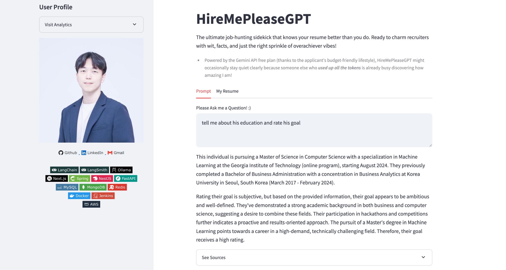
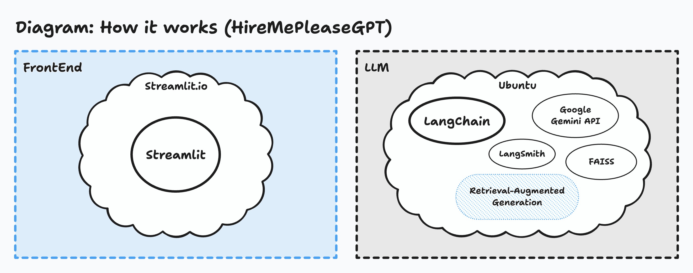

# HireMePleaseGPT

<table>
  <tr>
    <td style="width:1/2;">
      
    </td>
  </tr>
</table>
 

  <strong>The ultimate job-hunting sidekick that knows your resume better than you! :)</strong>
   
   
  
  
  
   
  
  
  

 

  
  <strong>↓ Check out prototypes ↓<strong>
   
   
  
  

 

# Introduction

HireMePleaseGPT is a chatbot built using Retrieval-Augmented Generation (RAG) architecture, powered by LangChain and Streamlit. It is designed to deliver precise and clear answers by retrieving information from archives of resumes and projects.
 

 
<b>Why do we need HireMePleaseGPT?</b>

In today’s bustling job market, recruiters often face the daunting challenge of sifting through mountains of resumes and projects with barely enough time to breathe, let alone dive deep. That’s where HireMePleaseGPT comes in—a simple yet genius solution to make life easier. Instead of painstakingly reading every word and deciphering the hidden treasures in a candidate’s resume, recruiters can now just ask HireMePleaseGPT anything they want to know. It’s like having a personal assistant who’s read every line for you and is ready with instant, meaningful insights—minus the coffee breaks!

 

# Implementation

<table>
  <tr>
    <td style="width:1/2;">
      
    </td>
  </tr>
</table>

 
<b>Retrieval-Augmented Generation</b>

HireMePleaseGPT is build as a RAG architecture, powered by LangChain, Google Gemini API, and FAISS vector database. Text from resume or cover letter is ingested to the FAISS vector database as soon as Google Gemini API embedded it into words or subwords. LangChain 

 

 
<b>Google Gemini API</b>

HireMePleaseGPT utilizes the Google Gemini API to embed text from resumes and generate responses. It employs “model/text-embedding-004” and “Gemini-1.5-flash,” both available under the free plan, offering sufficient computational performance for a RAG architecture tailored to processing single or double-page PDF documents, such as resumes and cover letters.

 

  
<b>Powered by Streamlit</b>

HireMePleaseGPT is deployed on the Streamlit.io platform. Steamlit framework provided well-built user-friendly UIUX blocks 

 

# Contribution

<!--
https://contrib.rocks/preview?repo=angular%2Fangular-ja
-->

